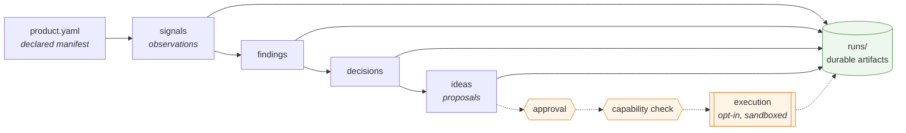

# Argus

ARGUS is a local-first operating layer for software portfolios. It converts declared
product state into inspectable signals, findings, decisions, and proposed actions while
keeping evidence, model interpretation, permission, and execution separate.

> **Status: experimental.** This is a working research system released for study and
> adaptation, not a product. See [maintenance status](#what-is-the-projects-maintenance-status)
> before depending on it.

---

## What is ARGUS?

A local CLI that treats each product as a node declared by a `product.yaml`. It reads what
is actually on disk, writes what it observed into files you can open, ranks what to do
next, and keeps execution behind explicit gates.

Everything it concludes lands under `runs/` as JSON with IDs and timestamps, so you can
ask "what did we record, when, and under which rules?" and get an answer you can diff.

| Path | Role |
| --- | --- |
| `argus/` | The implementation: signals, findings, decisions, ideas, orchestration, builder, CLI |
| `products/` | Product nodes. Each declares itself via `product.yaml`. Ships one fictional example |
| `runs/` | Local output. Gitignored apart from its README; this is the audit trail |
| `docs/` | Architecture, contracts, and operating docs |

The complete command reference, subsystem map, and configuration detail live in
[`docs/argus-reference.md`](docs/argus-reference.md).

---

## What problem does it solve?

Running more than one product by memory, chat logs, or a model that sounds sure.

Chat models are good at conversation, drafting, and brainstorming. They are a poor
operating record: the same question can get a different answer, "why" is hard to prove,
and nothing stops a fluent paragraph from being treated as permission to change a tree.

Argus is built for the other job — repeatable, portfolio-scale operations on real product
trees, with evidence you can audit.

| Dimension | Typical LLM chat | Argus |
|-----------|------------------|--------|
| **Grounding** | Training plus your prompt | Declared products, collected signals, versioned artifacts under `runs/` |
| **Repeatability** | Same question, different answers | Core pipelines are deterministic where designed; optional LLM paths are labeled and non-authoritative |
| **Auditability** | Hard to prove why a recommendation appeared | JSON bundles with IDs, timestamps, and a trace from signal → finding → decision → idea |
| **Temporal honesty** | Easy to sound current | Freshness and staleness are first-class; the clock is not confused with meaning |
| **Execution** | No built-in gate | Autonomy tiers, approvals, dry-runs, and a sandbox |

---

## What is its central technical thesis?

These are load-bearing, not slogans:

- **Evidence before interpretation.** Signals observe; findings infer. A narrative sentence
  is not allowed to acquire the authority of a measurement.
- **Inspectable artifacts instead of conversational memory.** If it was not written under
  `runs/`, nothing downstream is permitted to trust it.
- **Freshness is different from meaning.** Staleness is data, not an error. Some scores
  therefore move with the clock on purpose.
- **Models may propose but do not silently authorize execution.** LLM paths exist, are off
  by default, and never become canonical scoring.
- **Autonomy is graduated.** Tiers, approvals, and capability checks are separate from the
  analytical spine, so making the analysis smarter cannot widen what the system may do.
- **Execution is gated and auditable.** An action must be approved, its required capability
  granted, and the working directory restricted. The default path is read-only.

---

## What is implemented today?

| Capability | State |
| --- | --- |
| Signals, findings, decisions, ideas, portfolio ranking | **Implemented.** The core spine, with deterministic scoring. |
| Durable artifacts, history, trends, freshness/staleness accounting | **Implemented.** |
| Autonomy tiers, approvals, capability gates, execution dry-run and sandbox | **Implemented.** |
| Builder — agent-driven code changes | **Partial.** A harness around an *external* coding agent: it selects a target, declares an allowed-path contract, invokes under OS-level containment on Linux, then classifies the result. It writes no application code itself, and applies only to products shaped like a catalog of ordered content slots. |
| LLM enrichment | **Optional and non-authoritative.** Off by default. Canonical scoring never depends on it. |
| Deployment, infrastructure provisioning, third-party service integration | **Absent.** Not started. |
| Remote fleet execution, cloud schedulers, hosted anything | **Out of scope by design.** |

For the fuller inventory of what is stubbed on purpose, see
[`docs/stub-inventory.md`](docs/stub-inventory.md). For an aspirational design target —
explicitly *not* current capability — see
[`docs/argus-context/north-star.md`](docs/argus-context/north-star.md).

---

## What is deliberately not autonomous?

The solid path below is read-only and runs by default. The dotted path changes things and
does not run unless you ask: an action must be approved, its required capability must be
granted, and execution is sandboxed.

Argus will not deploy, provision infrastructure, call third-party services, or run a
remote fleet. Builder will not write application code itself. Optional model output cannot
authorize an action. Convincing an operator to approve a harmful action is outside the
security boundary the gates enforce — see [SECURITY.md](SECURITY.md).

---

## How does the deterministic spine work?



`runs/` is the audit boundary. Every stage writes there. Nothing downstream trusts
anything that was not written down.

---

## Prove it in five minutes

Requires Python 3.11 or 3.12 and [`uv`](https://docs.astral.sh/uv/). Initial dependency
installation requires network access. After installation, the deterministic proof and test
suite require no network, API keys, external agent, or configuration. The repository ships
one fictional product, `example-app`.

```sh
uv sync                                    # install
uv run argus products validate             # 1. does the product node parse?
uv run argus builder next-expansion example-app --json --no-save
                                           # 2. what should be built next, and why?
uv run argus portfolio refresh             # 3. run the whole spine
cat runs/portfolio/latest/summary.txt      # 4. read the conclusion
uv run pytest -q                           # 5. the full suite, ~40 seconds
```

Step 2 is a pure function of the catalog, so it is **byte-stable** — it selects
`group_01_slot_03` every time, and explains itself:

```
"id": "group_01_slot_03",
"rationale": "Heuristic: group 1 (Coast Path) currently has the strongest embodied
 spine in the catalog (2 embodied slot(s); hub page present) ..."
```

It also records an *explicit non-target* — the reason it declined to start a new group.

Step 3 writes a portfolio summary naming one ranked candidate for `example-app`. Step 5
collects **2127 tests** and should fail none of them. Some containment tests skip on
hosts without Linux bubblewrap — CI currently reports 2115 passed and 12 skipped.

**One honest caveat about determinism.** Step 2 is byte-stable. The test suite is hermetic
and deterministic; platform-specific containment tests may skip when their required Linux
facilities are unavailable. Step 3 is not entirely byte-stable: some signals measure
*file age*, so findings and the numeric score shift as the checkout gets older. That is
deliberate — staleness is a first-class input. The *shape* of the output is stable;
specific ages and the score are not.

A deeper, maintainer-oriented proof checklist lives in
[`docs/proof-run.md`](docs/proof-run.md).

---

## Where should a reviewer read next?

Three reading paths, depending on why you are here, are laid out in
**[`docs/portfolio-review.md`](docs/portfolio-review.md)**:

- **Evaluating this in five minutes** — the proof above, plus the two or three files worth opening.
- **Assessing the engineering** — the architecture, the boundaries, and where the judgement calls are.
- **Changing something** — how to get oriented and what the contribution constraints are.

---

## What is the project's maintenance status?

**Experimental software released for study and adaptation. Maintained as time permits. No
production-support commitment.**

Open source here means the source is open and the reasoning is legible. It does not imply
active support, a roadmap, or responses to feature requests. Issues and pull requests are
welcome but may not be answered promptly. If you need something dependable, fork it.

Security reporting: see [SECURITY.md](SECURITY.md). Contribution notes:
[CONTRIBUTING.md](CONTRIBUTING.md). Conduct: [CODE_OF_CONDUCT.md](CODE_OF_CONDUCT.md).

Licensed under the Apache License 2.0 — see [LICENSE](LICENSE) and [NOTICE](NOTICE).

Created by Sean Wylie and released as an open-source experiment through Wise Kids Studios.
