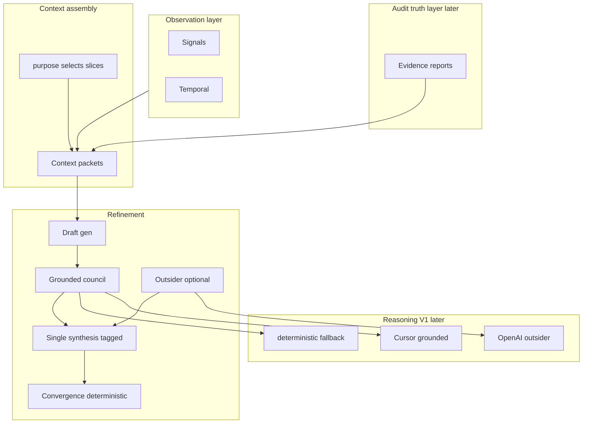

# Reasoning, context, and refinement architecture

**Shipped (V1):** [`argus/context/`](../../argus/context/) — purpose-aware bundles (`product.system`, `artifact.draft`), `ARGUS_CONTEXT_PACKETS=1` wires refinement prompts; convergence unchanged.

---

## Executive summary

**Today**, Argus already separates **observation** (signals, temporal) from **interpretation** (findings, advisors) and keeps **decisions** explainable via confidence/uncertainty/risk ([`docs/argus-context/08-operating-principles.md`](docs/argus-context/08-operating-principles.md)). **Idea generation** is largely deterministic with inspectable bundles; **optional** OpenAI augments advisor runs and idea expansion ([`docs/idea-generation.md`](docs/idea-generation.md)). **Artifact refinement** implements a multi-round loop with **type-specific councils**, structured JSON reviews, synthesis, and **deterministic convergence** ([`argus/refinement/`](argus/refinement/), [`docs/artifact-refinement.md`](docs/artifact-refinement.md)). **Capabilities** today describe **Argus platform** coverage and inferred gaps—not deep per-product codebase truth ([`argus/capabilities/registry.py`](argus/capabilities/registry.py)).

**Proposed evolution**: first-class **Context Assembly** with **purpose-aware slicing**, **hard size caps**, **`context_sources` provenance**, and **`packet_version`** on every packet; **Audit** as evidence layer with **required `coverage`**, **confidence per claim**, and **unknown ≠ missing**; **Reasoning** behind a **thin V1 mapping** (grounded→Cursor, outsider→OpenAI, deterministic→fallback); **Outsider never drives convergence** but **may** trigger **human_review** or **uncertainty** via deterministic policy; **single synthesis** with tagged themes (dual deferred); **explicit budgets** so one idea does not imply 10+ calls every time. **Convergence and autonomy remain deterministic.**

**North star (one line)**: LLMs/Cursor produce claims tied to citations or labeled low-trust; convergence and autonomy stay deterministic.

---

## Honest baseline: what exists vs what is new

| Area | Exists today | Proposed (new or extended) |
|------|----------------|----------------------------|
| Multi-round refinement | Yes: drafts, reviews, synthesis, convergence, sessions under `runs/refinement/` | Extend **inputs** from packets; optional council phases later |
| Council per artifact type | Yes: [`argus/refinement/routing.py`](argus/refinement/routing.py) | Later: grounded vs outsider membership; **convergence unchanged** until explicitly extended |
| Structured reviews | Yes: JSON verdicts, categories | Later: optional dimensions; **single tagged synthesis** first |
| Convergence | Deterministic in [`argus/refinement/convergence.py`](argus/refinement/convergence.py) | **Keep deterministic**; first slices **do not change** convergence |
| Advisor system | [`argus/advisors/`](argus/advisors/) + LLM optional | Later: shared executor; **not** required for first slice |
| Context for advisors | [`gather_consultation_context`](argus/advisors/runner.py) | **`assemble_context_packet(..., purpose=...)`** + typed packets |
| Repo “truth” | Signals, yaml, findings | **Audit** pipeline later; **four-state** implementation status |
| Cursor / IDE | **Not integrated** | V1 grounded backend when ready |
| Duplicate idea control | Fingerprints, selection | Later: audit-linked **exists** checks |

---

## Purpose-aware context assembly (critical)

**API shape**: every assembly is **scoped by purpose**, not generic:

```text
assemble_context_packet(repo_root, product_id, purpose: ContextPurpose, **kwargs)
```

Examples of **`ContextPurpose`** (enum or string contract): `idea_generation`, `refinement_grounded`, `refinement_outsider`, `product_spec_draft`, `implementation_plan`, `advisor_portfolio`.

**Slicing** (avoid structured prompt bloat):

| Purpose | Include heavily | Omit or minimal |
|---------|-----------------|-----------------|
| `idea_generation` | gaps, findings, lifecycle, temporal summary | Full doctrine, full experiments, full audit map |
| `refinement_grounded` (early slice) | `product.system` + `artifact.draft` | Market packet, optional until outsider phase |
| `implementation_plan` | capability map / audit summary (when exists), draft | Marketing / outsider fluff |

**Rule**: If you pass “everything” every time, you recreate **prompt dump** in JSON form. **Purpose** selects sections **and** applies **hard caps** (below).

---

## Context size caps (hard — prevent packet creep)

Purpose slicing is not enough; packets **grow over time** unless bounded. **Every** assembler path applies defaults (tunable in config later):

| Field / dimension | Example default cap | Rationale |
|-------------------|---------------------|-----------|
| Findings included | Top **10** by severity/recency (policy) | Prevents giant finding lists |
| Gaps / capability gap refs | Top **10** | Same |
| Doctrine excerpt | **Max chars** (e.g. 4–8k) or hashed pointer + excerpt | Doctrine stays bounded |
| Strategy block | Max chars (e.g. 2–6k) | |
| Temporal summary | Compact single object | |
| Artifact history / prior rounds in packet | **Depth** max (e.g. last **1** round summary only in V1) | Full history belongs on disk, not in packet |

**Principle**: Prefer **drop + count** (“`findings_omitted: 37`”) over silent truncation.

---

## Context provenance (every packet)

Each emitted packet (or bundle) includes **`context_sources`**: a list of **logical source ids** (and optionally resolved paths) so operators can trace **what was read**, e.g.:

```yaml
context_sources:
  - products/<id>/product.yaml
  - runs/findings/latest/<product>.json
  - runs/strategy/current.json
  - runs/signals/latest/<product>.json
```

**Why**: traceability, debugging, future **audits of context quality** (“why did this prompt look like this?”).

---

## Packet versioning

Every packet includes explicit **`packet_schema` / `packet_version`** (e.g. `argus.context_packet.v1` or `packet_version: 1`). **Contracts evolve**; consumers and tests pin on version.

---

## Context layer — packet types

**Owner**: **`argus.context`** — validate, cache, serialize.

**Packet types (evolutionary)**:

- **`product.system`**: identity, lifecycle, constraints, strategy snapshot, **sliced** doctrine/stub/gap refs per purpose.
- **`artifact.draft`**: artifact text, type, round, session id, lineage.
- **`product.market`** (later, outsider): short positioning / pitch context — not full repo.
- **`audit.summary`** (later): see §2 — **must** include `coverage` when present.
- **`temporal.freshness`**: compact; include only when purpose needs freshness.

**Audit-style fields in packets** (when audit exists): `already_exists` entries MUST carry **per-entry confidence** (e.g. `high|medium|low` or 0–1), e.g.:

```yaml
already_exists:
  - id: streaming
    confidence: high   # evidence-backed
    evidence: [...]
```

**Caching**: Per refinement **cycle** / ideas run — cache keyed by `(purpose, product_id, inputs_fingerprint)` — extend pattern from [`argus/refinement/context_cache.py`](argus/refinement/context_cache.py).

---

## 2) Audit / codebase awareness

**Role**: Machine-checkable **evidence** — not “LLM says it’s built.” **OpenAI must not define `already_exists`.**

**Four-state rule (non-negotiable)**: For each tracked capability or claim, status is one of **`implemented` | `partial` | `missing` | `unknown`**. **Never collapse `unknown` → `missing`.** Otherwise Argus gains **false confidence** (“doesn’t exist”) when reality is indirect abstraction, another repo, runtime-only behavior, or incomplete scan.

**Mechanisms** (later phases): Cursor-grounded audit JSON; deterministic ripgrep/markers; hybrid + scope manifests under `runs/audit/`.

**When to run** (tiered — ties to **budgets**, §Budgets): pre-idea light; promotion to spec deeper; implementation heavy grounded; **not** full stack on every idea.

**Avoid full-repo scans**: manifests, hashes, `quick` vs `deep` tiers.

### **`audit.summary.coverage` (required when audit exists)**

So “we didn’t find it” is never confused with “it doesn’t exist,” every **`audit.summary`** MUST include:

```yaml
coverage:
  scanned_paths: [...]    # globs or roots actually walked
  excluded_paths: [...]   # explicit exclusions
  depth: quick | deep
```

Interpretation: absence of a hit under **`coverage`** implies **unknown** or **not scanned**, not **missing** — unless a positive check ran inside scanned scope.

---

## Budgets (explicit — add early)

Without caps, **context + audit + grounded + outsider + multi-round refinement** can produce **10+ LLM/Cursor calls + scans** per idea.

**Defaults to specify in policy/config**:

- **Max audit depth** per stage (`quick` vs `deep`, tied to promotion).
- **Max reasoning calls per refinement session** (and per round).
- **Max rounds** (already partially present — keep central).
- **Stage defaults — don’t always run everything**:
  - **Idea**: light audit (when audit exists) + optional outsider only if enabled.
  - **Promotion to spec**: deeper audit + grounded council emphasis.
  - **Implementation plan**: **heavy grounded only**; outsider off or narrative-only.

**Principle**: *Selective execution* beats *always-on pipeline*.

---

## 3) Reasoning backend abstraction — V1 simplicity

The three-way split (`deterministic | cursor | openai`) is powerful but **must not become a mini ML orchestration platform** in V1.

**V1 mapping (keep general interface narrow)**:

| Role | V1 default |
|------|------------|
| Grounded (truth/feasibility) | **Cursor** when available |
| Outsider (market/creative pressure) | **OpenAI** when enabled |
| Fallback / offline | **Deterministic** stubs |

**Defer**: exotic backends, per-stakeholder model zoos, complex routing graphs. **One executor interface**, **three implementations**, **clear fallback + warn**.

**Later**: enrich `ReasoningRequest` metadata; not required for first slices.

---

## 4) Grounded vs outsider councils

- **Grounded**: reality, feasibility, doctrine/architecture alignment; may use **`audit.summary`** when present.
- **Outsider**: “does this matter?”, “is it compelling?” — **not** implementation truth.

**Outsider influence (refined)**:

- Outsider **NEVER** blocks convergence (no FAIL / pass_ratio / weighted threshold driven by outsider alone).
- Outsider **MAY** (via **deterministic policy** consuming outsider structured output):
  - **Route to `human_review_required`** in bounded cases (e.g. “misrepresentation / ethics / compliance” flags if you add such fields), or
  - **Increase uncertainty** (and related decision/refinement signals) — **without** changing grounded approval math.

**Convergence math** remains **grounded-only**; outsider effects are **orthogonal** side-channels into policy/UX/assessment — **not** extra votes in the same formula.

---

## 5) Synthesis: single vs dual

**Recommendation for V1**: **One synthesis step** with **tagged themes** (and tagged objections), e.g.:

```json
"themes": [
  { "source": "grounded", "issue": "no monetization path" },
  { "source": "outsider", "issue": "not compelling vs alternatives" }
]
```

**Dual synthesis** (grounded synth + outsider synth + merge) is theoretically cleaner but **doubles cost and complexity** — **defer** until single-synthesis proves insufficient.

---

## 6–11) Refinement, ideas flow, confidence, policy

Unchanged in spirit from prior plan: refinement orchestration consumes **packets**; idea pipeline later prioritizes **audit-verified gaps**; confidence/uncertainty absorb **disagreement** and **low audit coverage**; rule-based policy before bandits.

---

## Phased rollout — revised sequence

**Do not implement the full plan at once.**

1. **Step 1 — First slice (packets minimal)**  
   - Implement **only** `product.system` + `artifact.draft` assembly with **`purpose=`** API.  
   - Wire into **refinement input path** (prompt construction / session meta).  
   - **Zero changes to convergence logic.**  
   - **No audit subsystem yet.**  
   - **No reasoning backend abstraction yet** (still use existing LLM/stub paths inside refinement).

2. **Step 2 — Cohesion pass** — docs, `argus-context` pointers, CLI/dashboard language aligned with packets.

3. **Step 3 — Run Argus** — operator loop + tests; confirm no regressions. **Observe** (qualitative): do ideas improve? does refinement feel more grounded? does repetition drop?

4. **Step 4 — Audit MVP** — deterministic/light audits, four-state status, `runs/audit/`, integrate into prompts and idea gates.

5. **Step 5 — Grounded council via Cursor** — V1 backend mapping; reviews before draft generation blast radius.

6. **Step 6 — Outsider council** — optional phase; single tagged synthesis; budgets enforced.

Later: full purpose slicing for ideas, cost telemetry, policy tuning.

### Implementation status (this repo)

| Step | Status | Notes |
|------|--------|--------|
| 1 — Context packets minimal | **Done** | `argus.context`, `assemble_context_bundle`, refinement prompts behind `ARGUS_CONTEXT_PACKETS=1`; convergence unchanged. |
| 2 — Cohesion pass | **Done** | Docs, `docs/argus-context/`, CLI wiring. |
| 3 — Run Argus | **Ongoing** | Operator / qualitative; no single CI gate. |
| 4 — Audit MVP | **Done** | `argus.audit`, **`bundle.json`** (`argus.audit_bundle.v1`, nine angles + `summary_lines`), legacy **`latest.json`** Product Gap, `audit.summary` + `audit_coverage` + `audit.angles` in context; idea score nudges Product Gap only; optional LLM idea expansion when packets on ([`docs/audit-mvp.md`](../audit-mvp.md), [`docs/audit-architecture.md`](../audit-architecture.md)). |
| 5 — Grounded council via Cursor | **Not started** | |
| 6 — Outsider council | **Not started** | |

---

## First implementation slice (tightened)

**Build ONLY this next (Context system V1)** — nothing else until this ships:

| In scope | Out of scope |
|----------|----------------|
| **`ContextPurpose`** + **`assemble_context_packet(..., purpose=...)`** | Audit pipeline |
| Packets **`product.system`**, **`artifact.draft`** only | `ReasoningRequest` router |
| **Purpose slicing** + **hard caps** (findings, gaps, doctrine size, artifact history depth) | Cursor subprocess |
| **`context_sources`** on every packet | Convergence changes |
| **`packet_version` / schema id** | Outsider phase |
| **Light caching** (keyed; same pattern as refinement cycle cache) | Backend abstraction |
| Refinement reads packets for grounding prompts | Changing [`evaluate_convergence`](argus/refinement/convergence.py) |
| Feature flag default **off** or no-op path | |
| Tests for packet shape + stable snapshots | |

**Then immediately**: cohesion pass — docs, `argus-context`, CLI naming, **no duplication** of context logic, **CLI mentions context layer**.

**Then**: run Argus again and observe (see Step 3).

**Strategic rule**: **Do not** jump to audit, Cursor, or council shape changes until packets exist — **everything else depends on packets**.

**Success**: Same decisions as today when flag off; when on, richer structured input **without** more LLM calls or convergence changes.

---

## Risks / tradeoffs (updated)

- **Slowness / cost**: **Budgets** + stage defaults + purpose slicing — not only “cache later.”
- **False confidence from audit**: **unknown** state + confidence on entries + never imply “missing” without evidence.
- **Context packet bloat**: **Purpose** is mandatory; **hard caps** + **omitted counts**; **provenance** for debugging.
- **Backend creep**: V1 = three backends, one interface; defer orchestration complexity.
- **Dual synthesis cost**: start **single** tagged synthesis.

---

## Package layout (incremental)

- `argus/context/` — purposes, packet models, assembly, **caps**, **provenance**, **version field**.
- `argus/audit/` — later.
- `argus/reasoning/` — later (thin V1).

---

## Migration

Preserve env gating; adapters from `gather_consultation_context` → packet builders for advisor path **after** refinement path proves out.

---

## Deterministic vs backend-driven

Unchanged: convergence, autonomy, thresholds, temporal clocks deterministic; prose generation backend-driven.

---

## Top 5 architectural decisions to review manually before coding

1. **Cursor integration surface**: subprocess CLI vs HTTP API vs file handoff — security, CI, reproducibility.
2. **Truth policy**: OpenAI **never** writes `already_exists` / repo truth — audit + deterministic only.
3. **Outsider vs convergence**: outsider **never** drives convergence thresholds; outsider **may** trigger **human_review** or **uncertainty** via **deterministic policy** only.
4. **Single tagged synthesis vs dual**: **default single**; revisit only if merge quality fails in practice.
5. **Scope manifest**: per-product `argus.scope.yaml` vs infer-only — operator burden vs scan cost.

---

## Proposed architecture (logical view)



**Principle**: Temporal/signals = clocks; audit = evidence objects; models = claims + citations or low-trust labels; **convergence = deterministic**.
