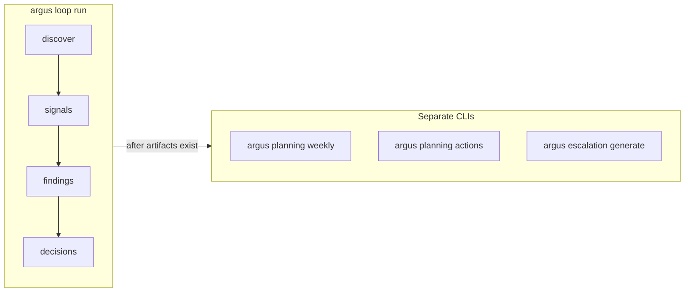

# Argus system flow (operator loop)

This is the **recommended** linear loop for local, inspectable artifacts. Commands assume the repo root contains `products/` and will create `runs/` as needed.

## Step-by-step

1. **Discover / validate** — `argus products validate` (or `list`) ensures manifests load.
1b. **Audit (optional, recommended for grounding)** — `argus audit run --product-id <id>` writes `runs/audit/<id>/latest.json` (deterministic capability map; see [audit-mvp.md](audit-mvp.md)). Improves context packets and idea nudges; not required for the core signal→decision loop.
2. **Doctrine (optional)** — `products/<id>/doctrine.yaml`; `argus doctrine show <id>` to verify parsing.
3. **Capabilities (as needed)** — `argus capabilities evaluate` / open **requests** when blocked; **`argus capabilities resume`** re-validates and clears pauses after gaps close (`--no-queue` = validate only).
4. **Signals** — `argus signals collect` and optional snapshot ingest populate `runs/signals/latest/`.
5. **Findings** — `argus findings generate` writes rule-based `Finding` records to `runs/findings/latest/` (includes doctrine violations when `repo_root` is provided).
   - After each signal collection, **temporal** sidecars (`runs/temporal/latest/`) record freshness over `observed_at` (see [temporal.md](temporal.md)); use `argus temporal summary` to inspect.
6. **Decisions** — `argus decisions generate` (or `portfolio refresh`) builds lifecycle-weighted `DecisionCandidate` lists and `runs/decisions/latest/`. Each run also writes a **decision context** assessment (`decision_context` in the bundle; see [decision-confidence.md](decision-confidence.md)) and `runs/decision_assessment/latest/<id>.json`.
6b. **Ideas (optional)** — `argus ideas generate` writes `runs/ideas/latest.json` (exploit / explore / invent) from signals, findings, synthesis, and mutation — see [idea-generation.md](idea-generation.md).
6c. **Refinement (optional)** — `argus refine` runs staged draft → council → synthesis → regeneration loops for `idea`, `product_spec`, or `implementation_plan` artifacts under `runs/refinement/` — routed **grounded vs outsider** councils via `argus.council` — [artifact-refinement.md](artifact-refinement.md), [councils.md](councils.md).
7. **Confidence (optional)** — `argus confidence explain <product>` or `assess` recomputes the assessment without regenerating decisions; useful after refreshing signals or advisors.
8. **Strategy (optional)** — `argus strategy set <mode>` writes `runs/strategy/current.json`, nudging priority and experiment scoring weights.
9. **History** — `argus history snapshot` captures portfolio state for drift/trends.
10. **Trends** — `argus trends analyze` writes `runs/trends/latest.json` from snapshot history.
11. **Experiments** — `argus experiments propose` / `rank` suggest hypotheses; `create` persists tracked experiments under `runs/experiments/`.
12. **Advisors** — `argus advisors run <product>` (stub or optional LLM); `consensus` merges perspectives under `runs/advisors/`.
13. **Simulation** — `argus simulate <product>` (optional `--experiment`) produces deterministic scenario branches from product + signals + experiment.
14. **Portfolio allocation** — `argus portfolio allocate` blends decision scores, economics, trends, and experiment counts into attention percentages.
15. **Planning** — `argus planning weekly` synthesizes markdown from latest artifacts.
16. **Autonomy (operator)** — `argus autonomy show` / `set` configures `runs/autonomy/` caps and mode before any execution.
17. **Actions / approval / execution (optional)** — contracts from planning or hand-written YAML; `argus approval` as needed; `argus execution dry-run` then `argus execution run` (autonomy + approval + sandbox).
18. **Dashboard** — `argus dashboard` renders static HTML from `runs/`.
19. **Doctor** — `argus doctor` checks staleness, doctrine, autonomy, approvals, capability requests, orphan experiments, advisor JSON, economics linkage, temporal integrity, decision-assessment gaps, high escalation pressure, ideas bundle JSON, refinement session index integrity, **per-product audit JSON** (missing or malformed under `runs/audit/`), **default council profiles**, and related gaps.

## Orchestrator boundary (planning & escalation)

Planning and escalation are **not** stages inside **`argus loop run`**. They use **separate commands** so weekly cadence, trigger rules, and review stay explicit:

**Orchestration** (`argus orchestration state`, optional **`advance`**, optional **`cursor-prompt` / `cursor-ingest`**) is **outside** **`loop run`**: **`state`** **re-reads** existing `runs/signals/`, `runs/temporal/latest/`, `runs/audit/`, `runs/refinement/`, etc., and writes **eligibility** JSON under `runs/orchestration/latest/` (and a **task** file under `runs/orchestration/tasks/latest/` when **`next_action` ≠ `none`**). It does **not** execute refinement or collect signals. **`advance`** records durable next-step **intent** under `runs/orchestration/latest/advancements/` (still no subprocess). Use **`state`** to see **blockers**, **escalation posture** (`escalation_triggers`), and **next legal actions**. See [`argus/orchestrator/README.md`](../argus/orchestrator/README.md).



## `argus loop run` (orchestrated analysis subset)

**`argus loop run`** chains **four** stages with a manifest under `runs/loop/<run_id>/`:

| Stage | Behavior |
|-------|----------|
| discover, signals, findings, decisions | Updates canonical dirs under `runs/signals/`, `runs/findings/`, `runs/decisions/`. |

**What it does not do:** planning, escalation, **`argus orchestration state`** (eligibility snapshot), doctrine/capabilities load, history/trends/ideas/experiments/advisors/dashboard/execution dry-run, etc. For an extended single command from discovery through dashboard (**16** stages, incl. **ideas** + planning snapshot + `runs/planning/actions.json`; **not** simulation or portfolio read—use **`argus simulate`** / **`argus portfolio`** separately), see **`argus loop full`** ([loop-harness.md](loop-harness.md)); it does **not** run **`argus escalation generate`**—use **`summary.json` → `chain.next_commands`** or run escalation manually per product.

**Planning and escalation after the loop** (or anytime artifacts are fresh enough):

```bash
uv run argus planning weekly
uv run argus planning actions
uv run argus escalation generate <product_id>
```

See [`argus/orchestrator/README.md`](../argus/orchestrator/README.md).

## One-shot shortcut

`argus portfolio refresh` runs a large subset (validate → collect → findings → decisions → portfolio summary) but does not replace history/trends/advisors/simulation/planning; run those when you need their outputs.

**Overlap:** `argus loop run` and `portfolio refresh` both refresh signals, findings, and decisions for participating products; `loop run` adds explicit stage artifacts under `runs/loop/<run_id>/` (no planning/escalation). Portfolio refresh also writes summary metadata under `runs/portfolio/latest/`.

## Example explanation

After **refresh**, you have ranked candidates per product. **Trends** adds momentum/risk flags. **Propose + rank** turns those into ordered experiment ideas without creating files until you **experiments create**. **Allocate** tells you where to spend attention this week; **planning weekly** turns that into a human-readable narrative for standups or reviews.
